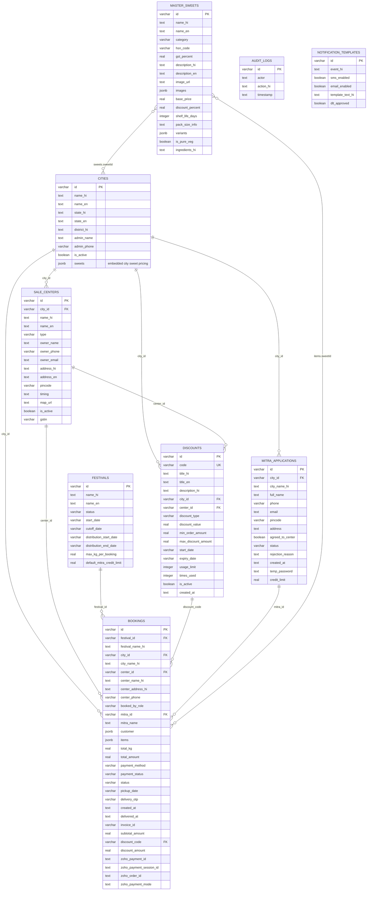

# Database Design

The application uses PostgreSQL through Drizzle ORM. Relationships below are logical application relationships because the current schema does not declare SQL foreign-key constraints.

## Table Responsibilities

| Table | Purpose |
|---|---|
| `master_sweets` | National master catalog of sweets, variants, pricing metadata, and bilingual content. |
| `cities` | City network configuration and city-specific sweet availability/pricing stored in `sweets` JSONB. |
| `sale_centers` | Pickup and distribution centers belonging to cities. |
| `festivals` | Festival booking windows, cutoffs, distribution dates, and credit limits. |
| `mitra_applications` | Sahakar Mitra registration, approval, and credit-limit data. |
| `bookings` | Customer/Mitra orders, pickup details, payment status, discounts, and fulfillment state. |
| `discounts` | City/center-scoped coupon definitions and usage limits. |
| `audit_logs` | Administrative activity history. |
| `notification_templates` | SMS/email notification configuration and message templates. |

## Embedded JSONB Structures

- `cities.sweets`: city-specific `{ sweetId, pricePerKg, isActive }` entries.
- `master_sweets.variants`: package options such as weight, label, and optional fixed price.
- `bookings.customer`: customer contact and address details.
- `bookings.items`: snapshot of ordered sweet and variant details at booking time.
