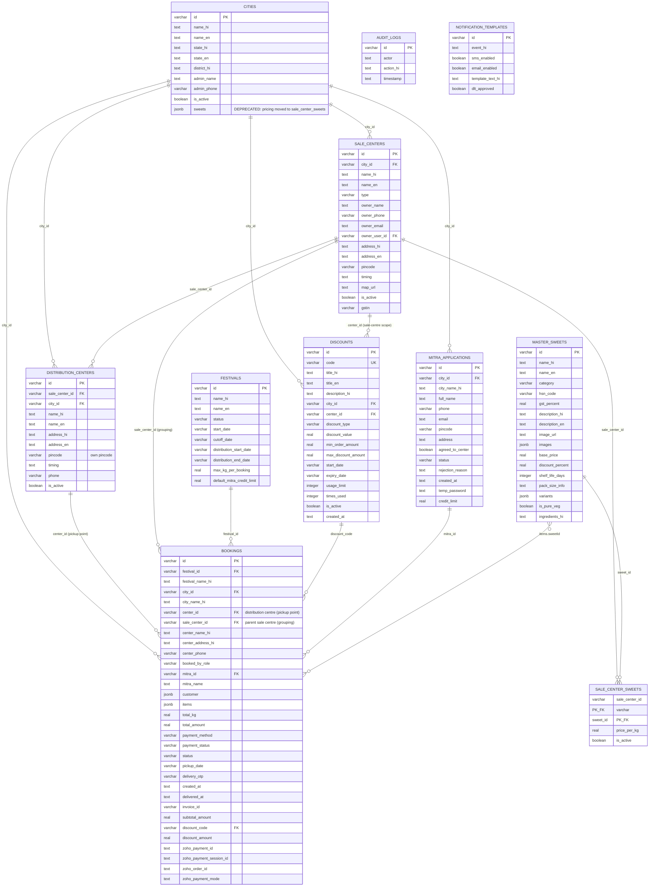

# Database Design

The application uses PostgreSQL through Drizzle ORM. Most relationships are logical (application-enforced), but the location hierarchy and the `users` identity references are enforced by real SQL foreign-key constraints (see the Foreign Keys section below). Relationships that are not backed by a constraint remain logical only.

The location network is a three-level hierarchy:

```
City
  └── Sale Centre            (grouping layer; sweet menu + pricing, discount + Mitra scope)
        ├── sweet menu + price   (sale_center_sweets: which sweets, at what price)
        ├── Distribution Centre   (pickup point, own address + pincode; inherits the menu)
        ├── Distribution Centre
        └── Distribution Centre

Order (booking)
  └── Distribution Centre    (selected at checkout; sale_center_id kept for grouping)
```



## Table Responsibilities

| Table | Purpose |
|---|---|
| `master_sweets` | National master catalog of sweets, variants, pricing metadata, and bilingual content. |
| `cities` | City network configuration. **Note:** the `sweets` JSONB column is deprecated — sweet availability/pricing now lives in `sale_center_sweets`. |
| `sale_centers` | Grouping layer belonging to cities; parents of distribution centres. Scope level for sweet pricing (via `sale_center_sweets`), discounts, and Sahakar Mitra attachment. |
| `sale_center_sweets` | Per-sale-centre sweet menu and pricing. Composite key `(sale_center_id, sweet_id)`. A sweet is offered by a centre only if a row exists (and `is_active`); distribution centres inherit their parent sale centre's menu. Replaces `cities.sweets`. |
| `distribution_centers` | Pickup points belonging to a sale centre. Each carries its own address and pincode and is what a customer selects at checkout and what a booking references. |
| `festivals` | Festival booking windows, cutoffs, distribution dates, and credit limits. |
| `mitra_applications` | Sahakar Mitra registration, approval, and credit-limit data. |
| `bookings` | Customer/Mitra orders. `center_id` references the pickup **distribution centre**; `sale_center_id` records its parent sale centre for grouping/reporting. Also holds pickup details, payment status, discounts, and fulfillment state. |
| `discounts` | City/sale-centre-scoped coupon definitions and usage limits. `center_id` refers to a **sale centre**, so a coupon applies to every distribution centre under that sale centre. |
| `audit_logs` | Administrative activity history. |
| `notification_templates` | SMS/email notification configuration and message templates. |

## Foreign Keys (enforced at the database)

The location hierarchy is enforced by SQL foreign-key constraints (added idempotently in `src/db/initDb.ts`):

| Constraint | Column | References |
|---|---|---|
| `sale_centers_city_id_fkey` | `sale_centers.city_id` | `cities.id` |
| `distribution_centers_sale_center_id_fkey` | `distribution_centers.sale_center_id` | `sale_centers.id` |
| `distribution_centers_city_id_fkey` | `distribution_centers.city_id` | `cities.id` |
| `bookings_sale_center_id_fkey` | `bookings.sale_center_id` | `sale_centers.id` |
| `bookings_center_id_fkey` | `bookings.center_id` | `distribution_centers.id` |
| `sale_center_sweets_sale_center_id_fkey` | `sale_center_sweets.sale_center_id` | `sale_centers.id` |
| `sale_center_sweets_sweet_id_fkey` | `sale_center_sweets.sweet_id` | `master_sweets.id` |

Identity references to the `users` table are also enforced: `cities.admin_user_id`, `sale_centers.owner_user_id`, `mitra_applications.user_id`, `audit_logs.actor_user_id`, and `bookings.customer_user_id` / `mitra_user_id` / `pickup_mitra_user_id`.

Because of these constraints, delete/reseed operations must remove rows in child → parent order (bookings → sale_center_sweets → distribution_centers → sale_centers → cities, and sale_center_sweets before master_sweets); the seed routine already does this.

All other relationships shown in the diagram (e.g. `discounts.city_id`, `discounts.center_id`, `bookings.discount_code`, JSONB `sweetId` references) remain logical and are enforced only in application code.

## Embedded JSONB Structures

- `cities.sweets`: **deprecated** city-specific `{ sweetId, pricePerKg, isActive }` entries. Superseded by the `sale_center_sweets` table; retained for backward compatibility only.
- `master_sweets.variants`: package options such as weight, label, and optional fixed price.
- `bookings.customer`: customer contact and address details.
- `bookings.items`: snapshot of ordered sweet and variant details at booking time.
